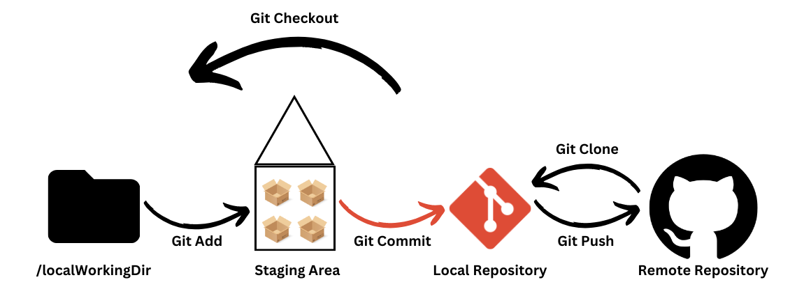
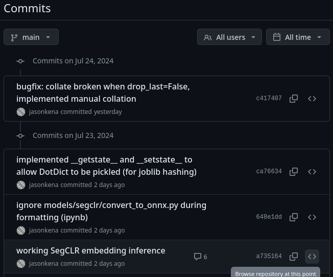
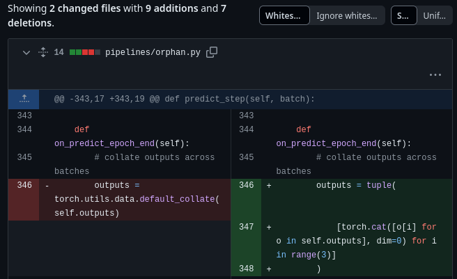

# Introduction to Git

The goal of this repository is to guide you through the basics of Git. Completing this tutorial will help you work with codebases here on GitHub and on other platforms such as GitLab.

To start with, watch this high-level, 4-minute introduction to Git: [How Git Works](https://www.youtube.com/watch?v=e9lnsKot_SQ)

Note that this tutorial assumes that you have access to a terminal with the `git` binary in your environment, and basic proficiency with the command line. For a quick rundown, see [this lecture from The Missing Semester](https://missing.csail.mit.edu/2020/course-shell/).

Now, onto the tutorial.

## Overview of Git



Git is the most popular source code manager (SCM). Other SCMs are used, such as [Apache Subversion](https://subversion.apache.org/) and [Mercurial](https://www.mercurial-scm.org/), but Git has won the popularity contest for a variety of reasons.

As most developers use Git, it is the focus of this tutorial.

You can think of Git as managing code between four locations: your local directories, the staging area, your local repository, and your repository on GitHub.

## Why does versioning matter?
If you're anything like me, you've likely created folders strewn with files named like `final_presentation5_LAST_EDIT.pptx`. We naturally version things, as it allows us to revert to previous changes which might be tedious to do by spamming `Ctrl-Z/Cmd-Z` (or simply because you you can't undo enough times). Git allows you to tackle this change tracking problem in a principled manner for text-like files (it can also manage blob-like files using [Git-LFS](https://git-lfs.com/), left as an exercise to the reader).

Git represents the snapshots of your codebase through the "commit history"

which is also viewable through the command line!
```bash
> git reflog
c417407 (HEAD -> main, origin/main) HEAD@{0}: commit: bugfix: collate broken when drop_last=False, implemented manual collation
ca76634 HEAD@{1}: commit: implemented __getstate__ and __setstate__ to allow DotDict to be pickled (for joblib hashing)
648e1dd HEAD@{2}: commit: ignore models/segclr/convert_to_onnx.py during formatting (ipynb)
a735164 HEAD@{3}: commit: working SegCLR embedding inference
...
```

More interestingly, you can view the line-by-line changes each individual commit has introduced,

```diff
git diff c417407~ c417407
diff --git a/pipelines/orphan.py b/pipelines/orphan.py
index b3be440..5c7e35c 100644
--- a/pipelines/orphan.py
+++ b/pipelines/orphan.py
@@ -343,17 +343,19 @@ class SegCLRInference(pl.LightningModule):

     def on_predict_epoch_end(self):
         # collate outputs across batches
-        outputs = torch.utils.data.default_collate(self.outputs)
+        outputs = tuple(
+            [torch.cat([o[i] for o in self.outputs], dim=0) for i in range(3)]
+        )
...
```

Having a comprehensive history of your codebase also allows you to revert (undo) specific changes you've made in the past, by simply running `git revert COMMIT`, and this works without the commit being the latest one!

For example, if you have commits `A -> B -> C -> D`, by doing `git revert C`, you can end up at a state where it's as if you've only done `A -> B -> D` (sweeping some details under the rug).

But perhaps the most useful feature of Git, is that it allows collaborative development using branches and merges. Here's a thought experiment. Let's say you have the following code:
```python
a = 2
print(f"the value of a is {a}")
```
and Alice modifies the code as follows:
```diff
a = 2
print(f"the value of a is {a}")
+ assert a == 2, "How could this happen, surely a is 2"
```
Bob, not knowing what Alice has done, writes:
```diff
- a = 2
+ a = 3
print(f"the value of a is {a}")
+ assert a == 3, "But I have 3 apples!"
```
How would you combine both of these changes to create cohesive code? And et voila, you've justified merge conflicts from first principles.

In summary, Git allows you to abstract away line-by-line changes in your code into "human-meaningful" divisions called commits. The commit history allows you to revert individual changes, and Git somehow allows multiple collaborators to sync contradictory changes.

But how? What is `HEAD`? What do the weird characters `c417407` mean? What is `origin/main`? How are Alice and Bob to communicate? How does Git know which files to track? Here there be dragons.

## Basic Commands

Introduce basic commands and their purpose.

## Project 1

Put the above commands into use by having students create a repository and make some basic changes.

## Branches, Explained

Explain how branches work, their purpose.

## Project 2

Have students work with branches.

## Git History

Show students how to use Git history to rebase, revert, etc.

## Project 3

Have students put history management into practice.

## Collaboration

Show how to use Git with collaborators, particularly on GitHub.

## Project 4

Create scenarios that do the following:

1. Have them use a repo where collaboration works perfectly (no merge issues).
2. Have them run into merge errors and walkthrough how to solve them.

## Further Reading

Provide info to further resources and highlight basic commands to get info such as `man`.

Here is an [excellent reference](https://git-scm.com/docs) on Git commands.
